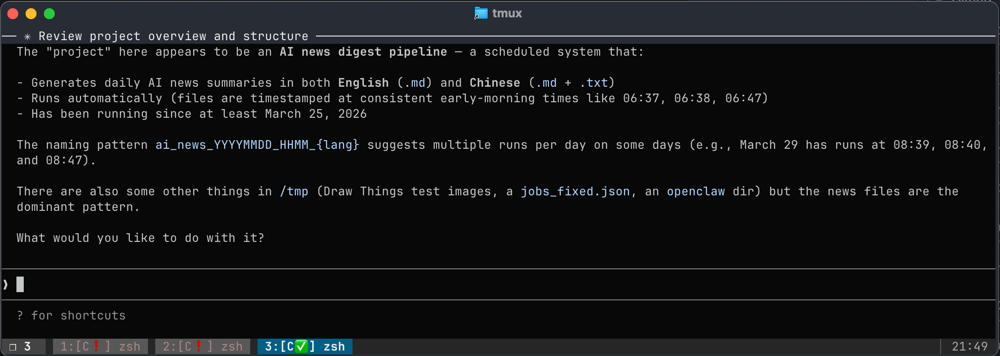

# AMux — Agent Mux

**Manage multiple AI Agent sessions in tmux.**

> 🚧 **Currently supported: Claude Code**. AMux is designed to support all major AI coding agents — more integrations are planned.



---

## English

### Why does this exist?

When working with AI coding agents, you often run multiple sessions simultaneously — one writing code, one running tests, one handling another task. The problem: **you don't know which session finished, which one needs your input, and which one hit an error**. You end up constantly switching windows to check.

AMux solves this by reflecting each session's state directly in the tmux window name. Wherever you are, you can see every agent session's status at a glance.

### Features

- **Automatic window naming**: Windows running Claude get a status prefix automatically
- **Status prefixes**:
  - `[C]` — Claude idle
  - `[C🔧]` — Tool call in progress
  - `[C✅]` — Done, waiting for your next instruction
  - `[C❗]` — Needs your attention (permission prompt, input required, etc.)
- **Pop-up notifications**: Brief alerts when a session finishes or needs input while you're elsewhere
- **Read-to-dismiss**: Switch to a window and `✅` / `❗` clear automatically
- **Non-invasive**: Does not modify your existing status bar styles
- **Terminal-only**: No macOS / Windows dependencies — works over SSH

### Installation

**One-liner:**

```bash
git clone https://github.com/cheney-yan/amux.git ~/.amux && bash ~/.amux/install.sh
```

The installer is fully automatic:
1. Makes all scripts executable
2. Detects your current shell and writes `AMUX_DIR` to the appropriate profile (`~/.zshrc`, `~/.bashrc`, etc.)
3. Appends an AMux source line to `~/.tmux.conf` (non-destructive)
4. Merges Claude Code hooks into `~/.claude/settings.json` (non-destructive)

### Upgrading

```bash
git -C ~/.amux pull
```

### Manual setup (without the installer)

Add to your shell profile:
```bash
export AMUX_DIR="$HOME/.amux"
```

Add to the end of `~/.tmux.conf`:
```bash
if-shell '[ -n "$AMUX_DIR" ]' 'source-file "$AMUX_DIR/tmux-addon.conf"'
```

### Usage

After installation, **just use tmux normally** — no extra steps required.

When you run `claude` in any pane, AMux detects it automatically and updates that window's name and status prefix.

### Requirements

- tmux 3.0+
- bash 3.2+ (macOS default is fine)
- python3 (only needed during install for merging Claude Code settings)
- `jq` (optional — shows Claude's notification message text in pop-up alerts)

### How it works

**Process detection** (`lib/status.sh`, triggered by Claude hooks and window-switch events):
Scans pane PIDs and their child processes for `claude` in the command line. When found, renames the window with the appropriate prefix.

**Claude Code hooks** (`lib/hooks/`, configured in `~/.claude/settings.json`):
Claude Code fires `PreToolUse`, `Stop`, and `Notification` hooks during its lifecycle. AMux hooks write state into tmux pane options (`@amux_state`), driving the window name prefix changes.

Each hook explicitly targets `$TMUX_PANE` so multiple Claude sessions never interfere with each other.

### License

MIT

---

## 中文

### 为什么做这个？

用 Claude Code 工作时，常常需要同时跑多个 session——一个在写代码，一个在跑测试，一个在处理另一个任务。问题是：**你不知道哪个 session 完成了，哪个在等你操作，哪个出错了**。你只能不停地切换窗口去检查。

AMux 解决这个问题。它通过修改 tmux 的 window 名字来实时反映每个 session 的状态，无论你在哪个窗口，一眼就能看到所有 Claude session 的情况。

### 功能

- **Window 自动命名**：有 Claude 在跑的窗口，名字自动加前缀，一眼可辨
- **状态前缀**：
  - `[C]` — Claude 空闲
  - `[C🔧]` — 正在调用工具
  - `[C✅]` — 完成，等待你的下一步指令
  - `[C❗]` — 需要你操作（权限确认、输入等）
- **弹出通知**：当你在其他窗口工作时，完成或需要交互会短暂弹出提示
- **读过即清除**：切换到该窗口，`✅` 和 `❗` 自动消失
- **无损添加**：不修改你现有的 status bar 样式，只追加必要配置
- **纯 terminal**：不依赖 macOS / Windows 特有机制，SSH 远程环境同样适用

### 安装

**一键安装：**

```bash
git clone https://github.com/cheney-yan/amux.git ~/.amux && bash ~/.amux/install.sh
```

安装脚本全自动完成以下四步：
1. 让所有脚本可执行
2. 检测当前 shell，自动写入对应的 profile（`~/.zshrc` / `~/.bashrc` 等）
3. 在 `~/.tmux.conf` 末尾追加 AMux source（不覆盖已有配置）
4. 将 Claude Code hooks 合并进 `~/.claude/settings.json`（不覆盖已有配置）

### 更新

```bash
git -C ~/.amux pull
```

### 手动配置

在 shell profile 里加：
```bash
export AMUX_DIR="$HOME/.amux"
```

在 `~/.tmux.conf` 末尾加：
```bash
if-shell '[ -n "$AMUX_DIR" ]' 'source-file "$AMUX_DIR/tmux-addon.conf"'
```

### 使用方式

安装完成后，**正常启动 tmux 即可**，无需做任何额外操作。

当你在某个 pane 里运行 `claude`，AMux 会自动检测到，并更新那个窗口的名字和状态前缀。

### 要求

- tmux 3.0+
- bash 3.2+（macOS 默认版本即可）
- python3（仅安装时需要，用于合并 Claude Code settings）
- `jq`（可选，用于在通知中显示 Claude 的消息内容）

### 工作原理

**进程检测**（`lib/status.sh`，由 Claude hooks 和 window 切换事件触发）：
扫描所有 pane 的子进程，在命令行里查找 `claude`。发现后，将 window 名字加上对应前缀。

**Claude Code hooks**（`lib/hooks/`，配置在 `~/.claude/settings.json`）：
Claude Code 在运行过程中触发 `PreToolUse`、`Stop`、`Notification` 三类 hook。AMux 的 hook 脚本将状态写入 tmux pane option（`@amux_state`），驱动 window 名字的前缀变化。

每个 hook 显式指定 `$TMUX_PANE`，多个 Claude session 并存时互不干扰。
